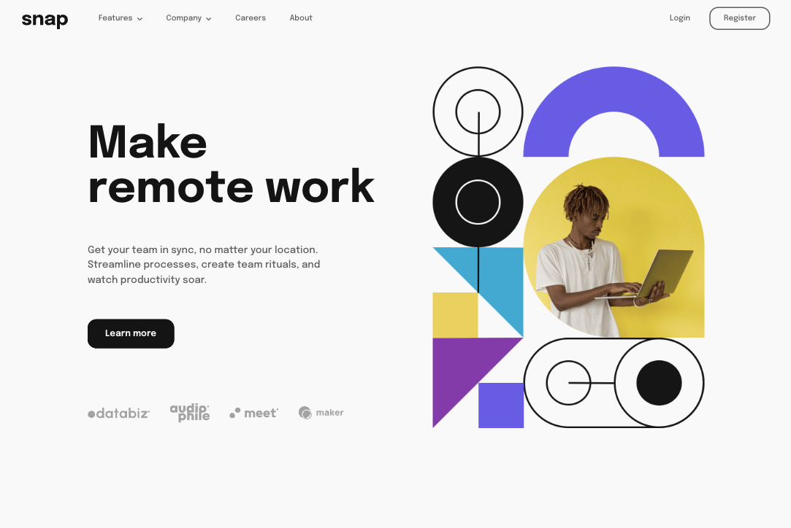

# Frontend Mentor - Intro section with dropdown navigation solution

This is a solution to the [Intro section with dropdown navigation challenge on Frontend Mentor](https://www.frontendmentor.io/challenges/intro-section-with-dropdown-navigation-ryaPetHE5). Frontend Mentor challenges help you improve your coding skills by building realistic projects. 

## Table of contents

- [Overview](#overview)
  - [The challenge](#the-challenge)
  - [Screenshot](#screenshot)
  - [Links](#links)
- [My process](#my-process)
  - [Built with](#built-with)
  - [What I learned](#what-i-learned)
  - [Useful resources](#useful-resources)
- [Author](#author)

## Overview

### The challenge

Users should be able to:

- View the relevant dropdown menus on desktop and mobile when interacting with the navigation links
- View the optimal layout for the content depending on their device's screen size
- See hover states for all interactive elements on the page

### Screenshot



### Links

- Solution URL: (https://your-solution-url.com)
- Live Site URL: (https://your-live-site-url.com)

## My process

### Built with

- Semantic HTML5 markup
- CSS media queries
- Flexbox
- Vanilla JS

### What I learned
Creating a dropdown menu from scratch - I learned to use the drop-shadow filter, and positioned the dropdown by attaching it as a child to the button.
```html
    <div>
      <a class="arrow-down menu-link" onclick="toggleMobileDropdown(0)" id="features-mobile">Features</a>
      <div class="dropdown-mobile hide" id="features-dropdown-mobile">
        <div class="menu-link">
          <a>
            
            Todo List
          </a>
        </div>
        <div class="menu-link">
          <a>
            
            Calendar
          </a>
        </div>
        ...
      </div>
    </div>
```

Vertical alignment for appbar items with the logo, and client logos - I learned about the vertical alignment attribute and utilized it to align images to the top and center of the container.
- [Vertically Align to Center](http://jsfiddle.net/kizu/4RPFa/4570/)
```html
  <div>
    <span class="helper"></span> <!--Helper for vertical alignment -->
    
  </div>
```
Used the Lobotamized owl to space list items.
```css
.dropdown > * + * {
  margin-top:  16px;
}
```
Mobile design - I put my previous knowledge of CSS media queries to use by specifying styles at specific width breakpoints for a responsive website
```css
  @media only screen and (max-width: 1000px) {}
```
### Useful resources

- [Lobotomized Owl](https://alistapart.com/article/axiomatic-css-and-lobotomized-owls/) - This was a useful and simple shorthand syntax for spacing a list of html elements.

## Author

<!-- - Website - [Dean Yang](https://www.your-site.com) -->
- Frontend Mentor - [@nekopudding](https://www.frontendmentor.io/profile/nekopudding)
